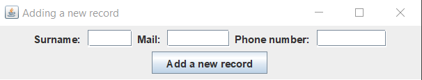
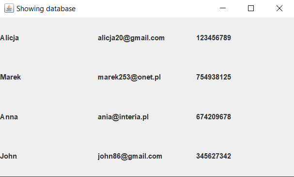
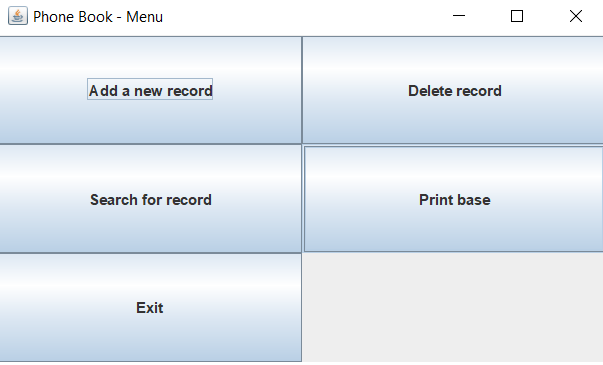

# PhoneBook
 I'm gonna introduce you... Phone Book! A simple windowed database, that collects phone numbers, names and emails.
## Technologies
  - Java 13
  - Swing (graphic)
  - HSQLDB (for database)
  
 ## Setup 
 If you're running this program for the first time you need to induce function "initDB()" in main function 
 to initialize database. Then it's all done and you can use it :) 
 
 Here is the command to run the game
  
  `$ javac phoneBook.java`
  
  ## Screenshots
  
   
   
   
   
   
   
   
  
